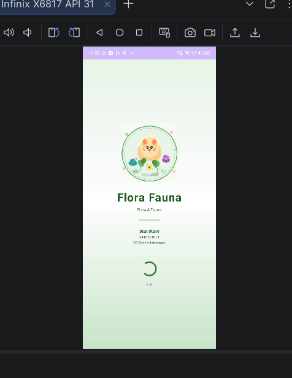
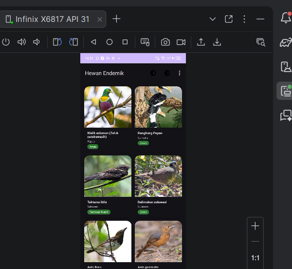
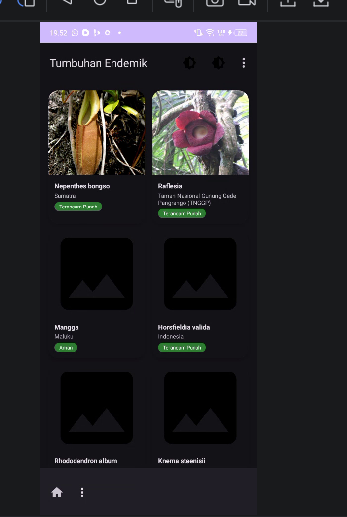
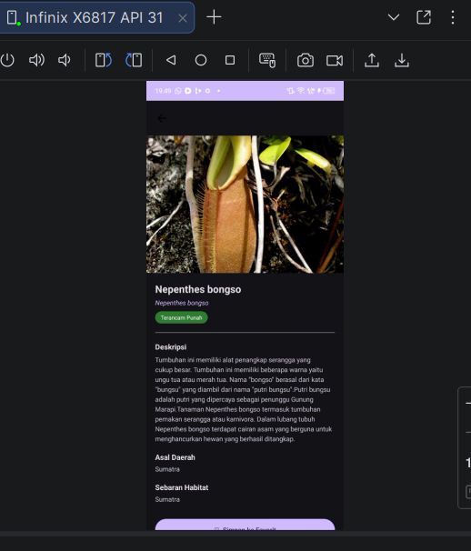
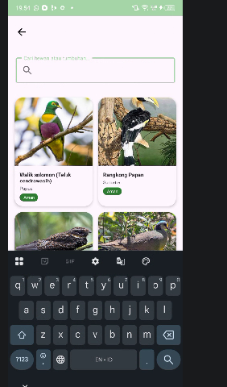
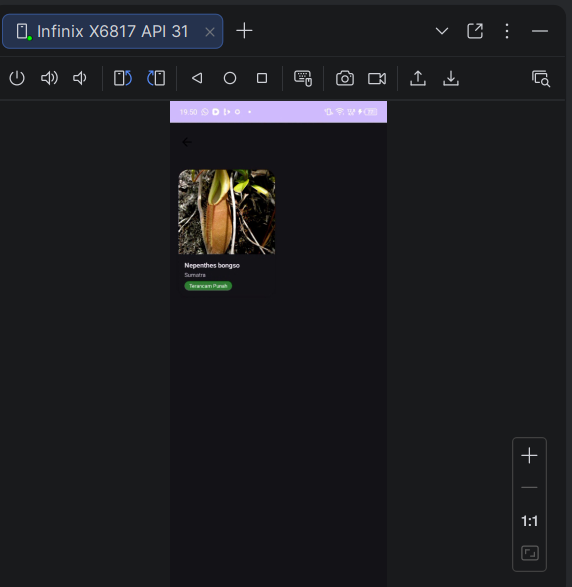
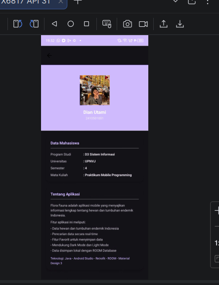
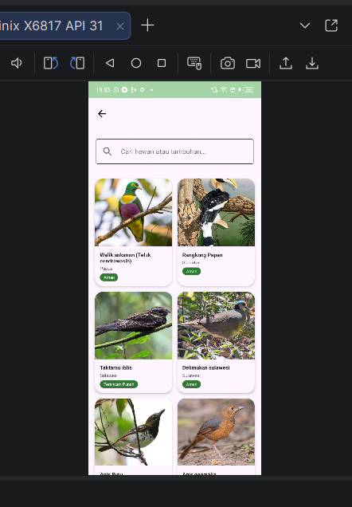
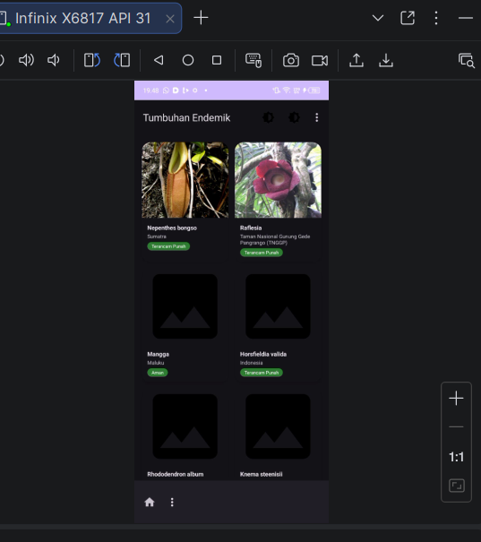

# 🌿 Flora Fauna App

Aplikasi Android edukasi yang menyajikan informasi mengenai **hewan dan tumbuhan endemik Indonesia** dengan tampilan modern, ringan, dan mudah digunakan.

## Identitas Mahasiswa

- Nama: Dian Utami
- NIM: 2410501001
- Program Studi: D3 Sistem Informasi
- Mata Kuliah: Praktikum Mobile Programming

## Deskripsi Aplikasi

Flora Fauna adalah aplikasi mobile yang dirancang untuk memberikan informasi mengenai kekayaan biodiversitas Indonesia, khususnya hewan dan tumbuhan endemik.

Aplikasi ini menyajikan data secara terstruktur dengan tampilan yang interaktif dan user-friendly, sehingga memudahkan pengguna dalam mengenali flora dan fauna Indonesia.

## Fitur Aplikasi

- - Menampilkan data hewan dan tumbuhan endemik Indonesia
- - Pencarian data secara real-time
- - Fitur Favorit 
- - Penyimpanan lokal menggunakan ROOM Database
- - Integrasi data menggunakan Retrofit (API)
- - UI modern berbasis Material Design

## Teknologi yang Digunakan

- Java
- Android Studio
- Retrofit (Networking API)
- ROOM Database
- Material Design Components

## Tampilan Aplikasi

### Splash Screen

### Home Hewan

### Home Tumbuhan

### Detail Screen

### Search

### Favorite

### Profile

### Light Mode

### Dark Mode

## Fitur:
- Splash Screen
- Home (Hewan Endemik)
- Home (Tumbuhan Endemik)
- Detail Data
- Pencarian
- Favorit
- Profil / Tentang
- Dark Mode/Light Mode